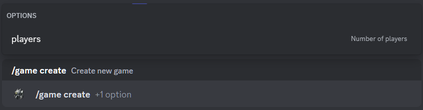

# Creating a new game

## Description

Command allows you to create a new game.
Optionally, you can specify the number of players. 
By default, the number of players is **6**.

## Command

**`/game create`** - creates a new game.

## Options

#### Optional

- **`players`** - number of players in the game.

#### Required

- _missing_

## Example

{ loading=lazy }

## Details

- Creates a new game for the specified number of players with the status **`Gathering`**.
- Creates a message in the game history channel.
- Creates a private thread for the game in the game history channel.
- Adds the player who created the game to the game.
- Creates a short link in the active games channel to the message in the game history channel.
