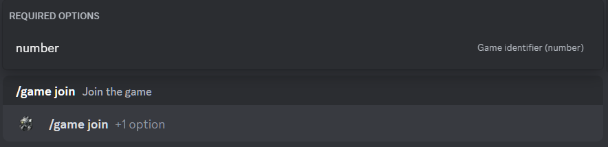

# Join game

## Description

Command allows you to join the game. 
You must specify the identifier (number) of the game to join. 

## Command

**`/game join`** - adds a player to the game.

## Options

#### Optional

- _missing_

#### Required

- **`number`** - identifier of the game to join.

## Example

{ loading=lazy }

## Details

- Adds a player to the game with the status **`Gathering`**.
- Adds a player to the private thread of the game in the game history channel.
- Updates the message in the game history channel.
- Updates the short link in the active games channel to the message in the game history channel.