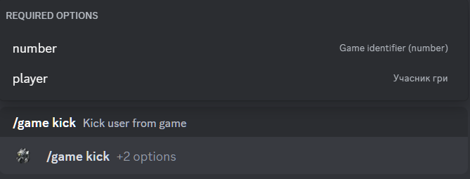

# Kick player from the game

## Description

Command allows you to remove a player from the game with the status **`Gathering`**. 
You must specify the identifier (number) of the game from which the player will be removed, and select the player from the list.

## Command

**`/game kick`** - removes a player from the game.

## Options

#### Optional

- _missing_

#### Required

- **`number`** - identifier of the game to leave.
- **`player`** - player you want to remove from the game.

## Example

{ loading=lazy }

## Details

- Removes a player from the game with the status **`Gathering`**.
- Removes a player from the private thread of the game in the game history channel.
- Updates the message in the game history channel.
- Updates the short link in the active games channel to the message in the game history channel.