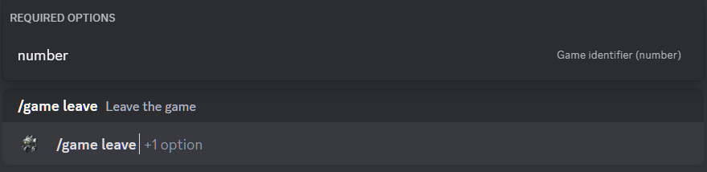

# Leave from the game

## Description

Command allows you to leave the game. 
You must specify the identifier (number) of the game to leave. 

## Command

**`/game leave`** - removes a player from the game.

## Options

#### Optional

- _missing_

#### Required

- **`number`** - identifier of the game to leave.

## Example

{ loading=lazy }

## Details

- Removes a player from the game with the status **`Gathering`**.
- Removes a player from the private thread of the game in the game history channel.
- Updates the message in the game history channel.
- Updates the short link in the active games channel to the message in the game history channel.