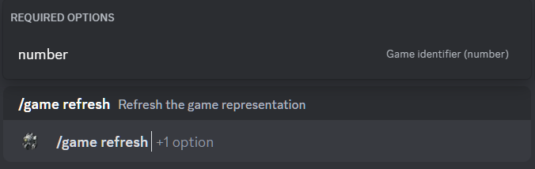

# Refresh Game

## Description

Command refreshes the game representations. 

## Command

**`/game refresh`** - refreshes the game representations.

## Options

#### Optional

- _missing_

#### Required

- **`number`** - identifier of the game.

## Example

{ loading=lazy }

## Details

- Updates the message in the game history channel.
- Updates the message in the thread of the game in the game history channel.
- Updates the short link in the active games channel to the message in the game history channel.