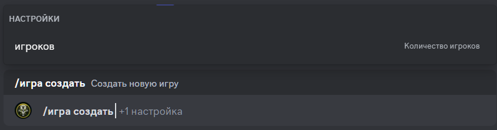

# Создание новой игры

## Описание

Команда позволяет создать новую игру.
По желанию можно указать количество игроков. 
По умолчанию количество игроков - **6**.

## Команда

**`/игра создать`** - создает новую игру.

!!! info "Подсказка"
    Помимо локализованной версии команды - **`/игра создать`**,
    вы можете вызвать команду на английском языке - **`/game create`**.

## Опции

#### Опциональные

- **`игроки`** - количество игроков в игре.

#### Обязательные

- _отсутствуют_

## Пример

{ loading=lazy }

## Детали

- Создает новую игру на указанное количество игроков со статусом **`Сбор`**.
- Создает сообщение в канале истории игр.
- Создает приватную ветку для игры в канале истории игр.
- Добавляет игрока, создавшего игру, в игру.
- Создает короткую ссылку в канале активных игр на сообщение в канале истории игр.