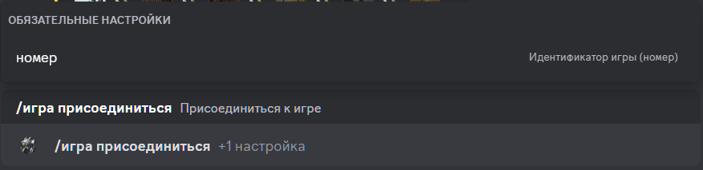

# Присоединиться к игре

## Описание

Команда позволяет присоединиться к игре. 
Обязательно нужно указать идентификатор (номер)  игры, к которой нужно присоединиться.

## Команда

**`/игра присоединиться`** - добавляет игрока в игру.

!!! attention "Внимание"
    Команда имеет перезарядку в 10 секунд до повторного использования.

!!! info "Подсказка"
    Кроме локализованной версии команды - **`/игра присоединиться`**,
    вы можете вызвать команду английским языком - **`/game join`**.

## Опции

#### Опциональные

- _отсутствуют_

#### Обязательные

- **`номер`** - идентификатор игры, к которой нужно присоединиться.

## Пример

{ loading=lazy }

## Детали

- Добавляет игрока в игру со статусом **`Сбор`**.
- Добавляет игрока в приватную ветку игры в канале истории игр.
- Обновляет сообщение в канале истории игр.
- Обновляет короткую ссылку в канале активных игр на сообщение в канале истории игр.