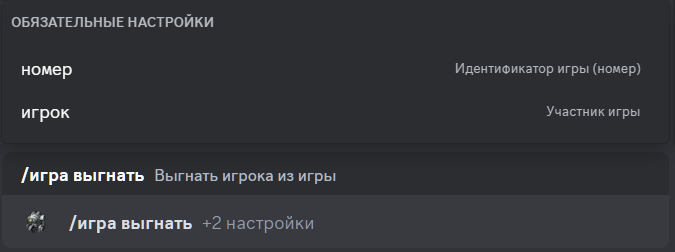

# Выгнать игрока из игры

## Описание

Команда позволяет выгнать игрока из игры со статусом **`Сбор`**.
Необходимо указать идентификатор (число) игры, из которой будет выгнано игрока, и выбрать игрока из списка.

## Команда

**`/игра выгнать`** - удаляет игрока из игры.

!!! info "Подсказка"
    Кроме локализованной версии команды - **`/игра выгнать`**,
    вы можете вызвать команду английским языком - **`/game kick`**.

## Опции

#### Опционально

- _отсутствуют_ 

#### Обязательно

- **`номер`** - идентификатор игры, из которой вы хотите выйти.
- **`игрок`** - игрок, которого вы хотите удалить из игры.

## Пример

{ loading=lazy }

## Детали

- Удаляет игрока из игры со статусом **`Сбор`**.
- Удаляет игрока из приватной ветки игры в канале истории игр.
- Обновляет сообщение в канале истории игр.
- Обновляет короткую ссылку в канале активных игр на сообщение в канале истории игр.