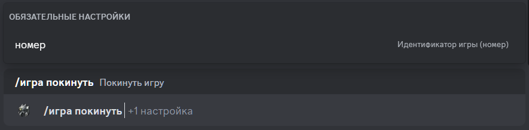

# Выход из игры

## Описание

Команда позволяет выйти из игры. 
Необходимо указать идентификатор (число) игры, из которой вы хотите выйти.

## Команда

**`/игра покинуть`** - удаляет игрока из игры.

!!! info "Подсказка"
    Кроме локализованной версии команды - **`/игра покинуть`**,
    вы можете вызвать команду английским языком - **`/game leave`**.

## Опции

#### Опционально

- _отсутствуют_ 

#### Обязательно

- **`номер`** - идентификатор игры, из которой вы хотите выйти.

## Пример

{ loading=lazy }

## Детали

- Удаляет игрока из игры со статусом **`Сбор`**.
- Удаляет игрока из приватной ветки игры в канале истории игр.
- Обновляет сообщение в канале истории игр.
- Обновляет короткую ссылку в канале активных игр на сообщение в канале истории игр.