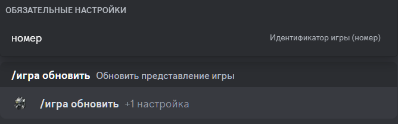

# Обновить игру

## Описание

Команда обновляет представления игры.  

## Команда

**`/игра обновить`** - обновляет представления игры.

!!! info "Подсказка"
    Кроме локализованной версии команды - **`/игра обновить`**,
    вы можете вызвать команду английским языком - **`/game refresh`**.

## Опции

#### Опционально

- _отсутствуют_ 

#### Обязательно

- **`номер`** - идентификатор игры, из которой вы хотите выйти.

## Пример

{ loading=lazy }

## Детали

- Обновляет сообщение в канале истории игр.
- Обновляет сообщение в ветке игры в канале истории игр.
- Обновляет короткую ссылку в канале активных игр на сообщение в канале истории игр.