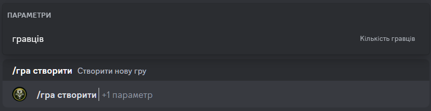

# Створення нової гри

## Опис

Команда дозволяє створити нову гру.
Опціонально можна вказати кількість гравців.  
За замовчуванням кількість гравців - **6**.

## Команда

**`/гра створити`** - створює нову гру.

!!! info "Підказка"
    Окрім локалізованої версії команди - **`/гра створити`**,
    ви можете викликати команду англійською мовою - **`/game create`**.

## Опції

#### Опціональні
- **`гравців`** - кількість гравців у грі.

#### Обов'язкові
- _відсутні_

## Приклад
{ loading=lazy }

## Деталі
- Створює нову гру на задану кількість гравців у статусі **`Збір`**.
- Створює повідомлення у каналі історії ігор.
- Створює приватну гілку для гри у каналі історії ігор.
- Додає гравця, що створив гру, до гри.
- Створює коротке посилання у каналі активних ігор на повідомлення у каналі історії ігор.
