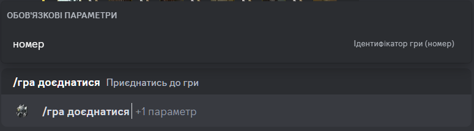

# Доєднатись до гри

## Опис

Команда дозволяє доєднатись до гри. 
Обов'язково потрібно вказати ідентифікатор (номер) гри, до якої потрібно доєднатись.

## Команда

**`/гра доєднатися`** - додає гравця до гри.

!!! attention "Увага"
    Команда має перезаряджання в 10 секунд до повторного використання.

!!! info "Підказка"
    Окрім локалізованої версії команди - **`/гра доєднатися`**,
    ви можете викликати команду англійською мовою - **`/game join`**.

## Опції

#### Опціональні
- _відсутні_

#### Обов'язкові
- **`номер`** - ідентифікатор гри, до якої потрібно доєднатись.

## Приклад
{ loading=lazy }

## Деталі
- Додає гравця до гри зі статусом **`Збір`**.
- Додає гравця до приватної гілки гри у каналі історії ігор.
- Оновлює повідомлення у каналі історії ігор.
- Оновлює коротке посилання у каналі активних ігор на повідомлення у каналі історії ігор.
