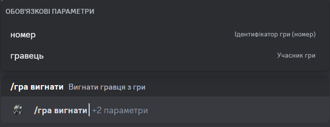

# Вигнати з гри

## Опис

Команда дозволяє видалити гравця з гри зі статусом **`Збір`**. 
Обов'язково потрібно вказати ідентифікатор (номер) гри, з якої буде видалено гравця, та вибрати гравця зі списку.

## Команда

**`/гра вигнати`** - видаляє гравця з гри.

!!! info "Підказка"
    Окрім локалізованої версії команди - **`/гра вигнати`**,
    ви можете викликати команду англійською мовою - **`/game kick`**.

## Опції

#### Опціональні
- _відсутні_

#### Обов'язкові
- **`номер`** - ідентифікатор гри, з якої ви хочете вийти.
- **`гравець`** - гравець, якого ви хочете видалити з гри.

## Приклад
{ loading=lazy }

## Деталі
- Видаляє гравця з гри зі статусом **`Збір`**.
- Видаляє гравця з приватної гілки гри в каналі історії ігор.
- Оновлює повідомлення в каналі історії ігор.
- Оновлює коротке посилання в каналі активних ігор на повідомлення в каналі історії ігор.
