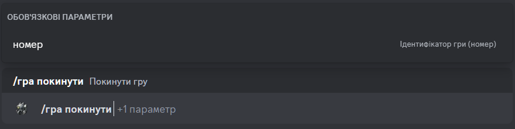

# Вихід з гри

## Опис

Команда дозволяє вийти з гри. 
Обов'язково потрібно вказати ідентифікатор (номер) гри, з якої ви хочете вийти.

## Команда

**`/гра покинути`** - видаляє гравця з гри.

!!! info "Підказка"
    Окрім локалізованої версії команди - **`/гра покинути`**,
    ви можете викликати команду англійською мовою - **`/game leave`**.

## Опції

#### Опціональні
- _відсутні_

#### Обов'язкові
- **`номер`** - ідентифікатор гри, з якої ви хочете вийти.

## Приклад
{ loading=lazy }

## Деталі
- Видаляє гравця з гри зі статусом **`Збір`**.
- Видаляє гравця з приватної гілки гри в каналі історії ігор.
- Оновлює повідомлення в каналі історії ігор.
- Оновлює коротке посилання в каналі активних ігор на повідомлення в каналі історії ігор.
