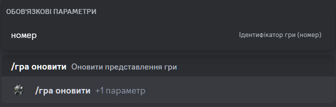

# Оновити гру

## Опис

Команда оновлює представлення гри. 

## Команда

**`/гра оновити`** - оновлює представлення гри.

!!! info "Підказка"
    Окрім локалізованої версії команди - **`/гра оновити`**,
    ви можете викликати команду англійською мовою - **`/game refresh`**.

## Опції

#### Опціональні

- _відсутні_

#### Обов'язкові

- **`номер`** - ідентифікатор гри, з якої ви хочете вийти.

## Приклад

{ loading=lazy }

## Деталі

- Оновлює повідомлення в каналі історії ігор.
- Оновлює повідомлення в гілці гри в каналі історії ігор.
- Оновлює коротке посилання в каналі активних ігор на повідомлення в каналі історії ігор.
